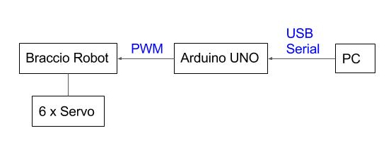

# Braccio-Arduino-ROS-RViz
Project on the integration of the Arduino robotic arm Braccio into ROS and Rviz.


This project enables to control the joint angles of Braccio from a GUI.


## Want to say thanks

 This code is free and can be used for free, open source and commercial applications. If you want to say thanks mainly hit the :star: button, that's all. 


## Prerequisites:


* ROS ([Kinetic Kame](http://wiki.ros.org/kinetic))
	* RViz
	* ROSserial
* Ubuntu (16.04)
* Arduino (Uno or higher)
* [Braccio Robot](https://store.arduino.cc/tinkerkit-braccio)

## Hardware Architecture


## Setup
* Install ROS on your PC.
* Clone this repository into your Catkin Workspace.
* Run 
```ruby
	catkin_make
```

* Install ROS for your Arduino, [see here for Instruction](http://wiki.ros.org/rosserial_arduino/Tutorials/Arduino%20IDE%20Setup) 
* Copy the BraccioLibRos Library into your Arduino Library Folder
* Flash your Arduino with the code included in the file braccio_ros.ino

* Make sure your Arduino is connected with the PC via a USB cable

## Run

### Terminal 1:
```ruby
	roscore
```

Launches Roscore, that handles communictation between all ROS nodes.

### Terminal 2:
```ruby
	source devel/setup.bash
	cd src/braccio_arduino_ros_rviz
	roslaunch braccio_arduino_ros_rviz urdf.launch model:=urdf/braccio_arm.urdf
```

Starts the GUI and publishes angles in Radian.

### Terminal 3:
```ruby
	source devel/setup.bash
	cd src/braccio_arduino_ros_rviz
	rosrun braccio_arduino_ros_rviz parse_and_publish
```

Converts the joint angles to degrees and reduces the message size 

### Terminal 4:
```ruby
    rosrun rosserial_python serial_node.py /dev/ttyACM0
```

Starts the communication between Arduino and Pc.
Change "/dev/ttyACM0" to the port the Port of your Arduino. 
You find this Information in the Arduino IDE, ArduinoIDE>Tools>Port.

### Terminal 5 (optional/Debugging):
```ruby
	rostopic echo joint_array
```

view what is published to the Arduino

```ruby
	rostopic echo joint_states
```

view what is published by the joint_state_publisher (GUI)

```ruby
	rqt_graph
```

overview about the topics and nodes

Should look similar like this:


## License


This project is licensed under  BSD 3-Clause License License - see the [LICENSE.md](LICENSE.md) file for details

This project contains code from [grassjelly](https://github.com/grassjelly/ros_braccio_urdf), see third Party License file [LicenseOfThirdPartys](Licenses_Related_Projects.md)